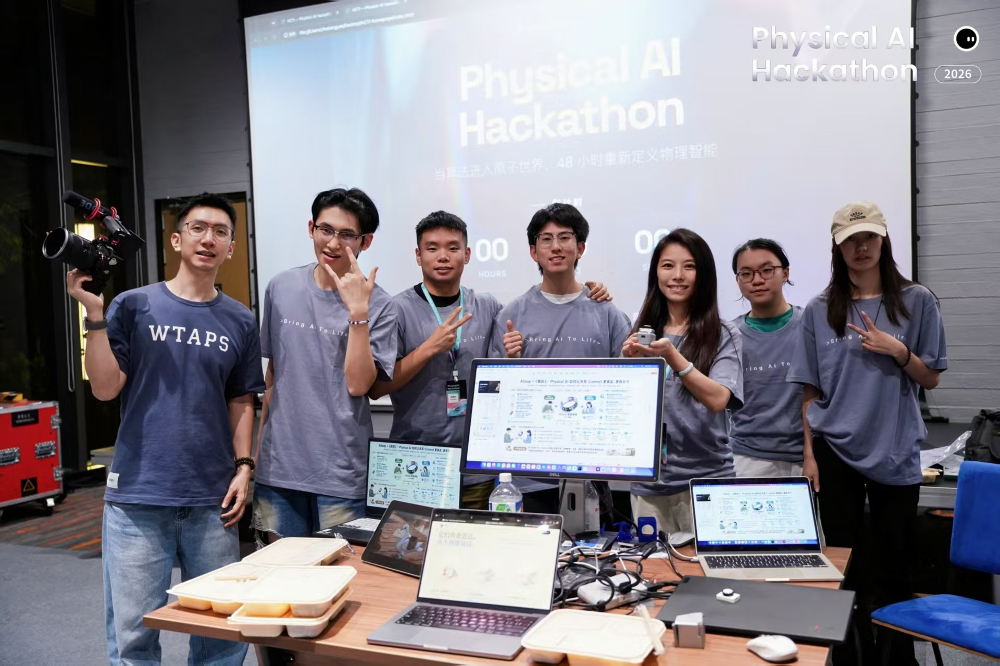

<p align="center">
  <a href="./README.md"><strong>English</strong></a> · <a href="./README.zh-CN.md">简体中文</a>
</p>

<h1 align="center">Wozai · 我在</h1>

<p align="center"><strong>Leave what matters with care. Entrust it to the right person. Let it return with restraint.</strong></p>

<p align="center">
  A relationship-centered life-record and entrustment project for the Hong Kong Physical AI Hackathon.
</p>

<p align="center">
  <a href="https://www.wozai.space/en/"></a>
  <a href="https://github.com/wujiajunhahah/loop/discussions"></a>
  
</p>

<p align="center">
  <a href="https://github.com/wujiajunhahah/loop/stargazers"></a>
  
  
  
  
  
  
  
</p>

<p align="center">
  <a href="https://www.wozai.space/en/"><strong>Website</strong></a>
  · <a href="https://www.wozai.space/#story">46-second concept film</a>
  · <a href="https://www.wozai.space/assets/documents/wozai-flyer.zh-CN.pdf">Project flyer</a>
  · <a href="./docs/README.md">Documentation</a>
  · <a href="./visual-prototype/README.md">Experience prototype</a>
</p>

<a href="https://www.wozai.space/en/">
  
</a>

## What is Wozai?

Wozai is an emotional companion product built around authentic life records and relationship entrustment. It helps a living creator preserve her own voice, videos, photos, words, and object stories, then personally decide who may receive them, how they may appear, and how they may be used.

It is not digital resurrection. AI may organize, retrieve, connect, and explain evidence, but it must never invent a new memory, promise, intention, or sentence on behalf of the creator.

The best place to understand the product is the bilingual [official website](https://www.wozai.space/en/). It brings together the product story, entrustment flow, future recipient experience, AI boundaries, [concept film](https://www.wozai.space/#story), and [project flyer](https://www.wozai.space/assets/documents/wozai-flyer.zh-CN.pdf).

## One product, two perspectives

The primary user is the living creator: for example, a mother who wants to make sense of her life, relationships, and wishes while she can still decide how they should be entrusted.

The “daughter experience” in the prototype is not a separate acquisition product. It first acts as a recipient-view preview for the creator. The mother can see how her material may be found, cited, and experienced in the future, understand what choices the recipient will have, and adjust the content or permissions before entrusting it.

```text
Creator preserves authentic material
  → personally confirms and authorizes each item
  → previews the future recipient experience
  → adjusts content, permissions, and entrustment
  → the authorized recipient chooses whether to open it
```

## Physical AI Hackathon

Wozai is built for the Hong Kong Physical AI Hackathon, in the alloop-supported human-centered track on state recognition and active support.

Our vertical scenario is simple: **make the presentation of meaningful memories sensitive to a person’s current capacity, without turning Wozai into a medical or generic health-management product.**

Alloop HRV is treated as a supporting state signal. It does not diagnose emotion and does not decide which memory is “important.” Together with explicit user feedback, it participates in a human-centered loop:

| Loop | Wozai interpretation |
| --- | --- |
| Sense | Receive Alloop HRV and the user’s text or voice interaction |
| Understand | Find grounded connections only within creator-confirmed material; use HRV only to tune presentation intensity |
| Respond | Present traceable original words with neutral messenger narration in a gentle or standard mode |
| Improve | Learn from “very relevant,” “too heavy,” “do not show this again,” and “this is not what she meant,” together with before/after interaction signals |

Here, learning means improving **retrieval, ranking, and presentation policy**. It never means learning to generate more things the mother never said. See the [track alignment document](./docs/hackathon/alloop-track-alignment.md) for the complete reasoning and demo narrative.

## Project toolbox

The repository keeps the website, product experiences, Physical AI inputs, analysis experiments, hardware assets, and project records together so the complete hackathon story remains inspectable.

| Path | What it contains | Start here |
| --- | --- | --- |
| [`landing/`](./landing/README.md) | Official bilingual website, concept film, flyer, FAQ, and co-creation subscription | [www.wozai.space](https://www.wozai.space/en/) |
| [`visual-prototype/`](./visual-prototype/README.md) | Creator view and recipient-view preview, memory capture, authorization, messenger interaction, and feedback | `pnpm dev` |
| [`pigeon-backend/`](./pigeon-backend/README.md) | FastAPI messenger API, grounded evidence, HRV presentation policy, feedback, and interaction outcomes | `/docs` on port `8010` |
| [`app/`](./app/README.zh-CN.md) | Alloop Kit Flutter/BLE application and device SDK starter | `flutter run` |
| [`omi_simple/`](./omi_simple/) | Omi voice-diary chunk forwarding example | Module source |
| [`pc/`](./pc/README.md) | Offline exploration of the 14-day wearable CSV dataset | Python scripts |
| [`data/sample_data/`](./data/sample_data/README.md) | Measurement and activity sample data | Data dictionary |
| [`server/`](./server/) | Local WebSocket, upload, and memory relay experiment | `npm start` |
| [`src/`](./src/) + [`ios/`](./ios/) | Relationship Agent, permissions, hardware contracts, simulator, and Capacitor iOS shell | Root Vite app |
| [`docs/hardware/models/`](./docs/hardware/models/README.md) | Editable Rhino 7 charger/enclosure CAD source | `.3dm` model |
| [`docs/`](./docs/README.md) | Hackathon, product, architecture, hardware, privacy, and demo documentation | Documentation map |
| [`.loop/`](./.loop/) | Design decisions, risks, interface requests, audits, and implementation task records | Project records |

## Quick start

### Official website

```bash
cd landing
python3 -m http.server 4173
```

Open <http://localhost:4173>.

### Experience prototype

```bash
cd visual-prototype
pnpm install
pnpm dev
```

Open <http://127.0.0.1:5174/>.

### Pigeon backend

```bash
cd pigeon-backend
python3 -m venv .venv
source .venv/bin/activate
python -m pip install -e ".[dev]"
python -m uvicorn app.main:app --host 0.0.0.0 --port 8010
```

Open <http://127.0.0.1:8010/docs>. Windows commands, environment variables, HRV examples, and the stable `/api/v1` contract are documented in [`pigeon-backend/README.md`](./pigeon-backend/README.md).

## Discussions and building together

We welcome developers, designers, hardware builders, researchers, storytellers, and people thinking carefully about memory, mortality, relationships, and AI boundaries.

[GitHub Discussions](https://github.com/wujiajunhahah/loop/discussions) is the best place to begin:

- discuss product scenarios and relationship-centered interaction;
- explore HRV, Physical AI, Alloop, Omi, BLE, and hardware ideas;
- examine grounded retrieval, AI narration, consent, privacy, and safety;
- share interface, industrial-design, CAD, documentation, and translation suggestions;
- ask questions before proposing a larger code or architecture change.

Focused issues and pull requests are welcome. For a larger direction, please start with a Discussion so context, boundaries, and the demo story remain aligned.

Please do not post real medical records, private family memories, credentials, device tokens, or other sensitive personal data in public Discussions, Issues, or pull requests.

<p align="center">
  <a href="https://github.com/wujiajunhahah/loop/discussions"></a>
</p>

## Team

<p align="center">
  
</p>

<p align="center"><em>The people building Wozai at the 2026 Physical AI Hackathon.</em></p>

## Product boundaries

- Original material remains available; AI organization is always distinguished from the creator’s own words.
- Content must be personally confirmed and authorized item by item and relationship by relationship.
- HRV is a relative state and presentation-intensity reference, never a medical or emotion diagnosis.
- AI may retrieve, connect, segment, and provide neutral narration, but it may not fabricate memories, promises, intentions, or new words for the creator.
- A recipient enters by choice and may postpone, skip, hide, or permanently close an experience.
- A recipient’s response belongs to the recipient and is never rewritten as an expression from the creator.

## Project materials

- Official website: [www.wozai.space](https://www.wozai.space/en/)
- Concept film: [watch online](https://www.wozai.space/#story)
- Project flyer: [Chinese PDF](https://www.wozai.space/assets/documents/wozai-flyer.zh-CN.pdf)
- Charger/enclosure model: [Rhino 7 source](./docs/hardware/models/wozai-charger-model.rhino7.3dm)
- Documentation map: [`docs/README.md`](./docs/README.md)

## Contact

- Website: [www.wozai.space](https://www.wozai.space/en/)
- Discussions: [github.com/wujiajunhahah/loop/discussions](https://github.com/wujiajunhahah/loop/discussions)
- Email: [hello@wozai.space](mailto:hello@wozai.space)
