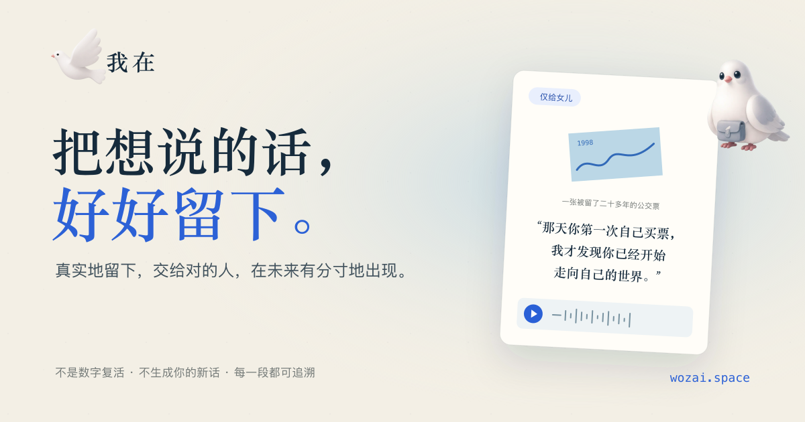

# 我在（wozai.space）

> 真实地留下，交给对的人，在未来有分寸地出现。

「我在」是一个面向生命受限创作者与重要关系接收者的数字记忆产品。它保存真实的文字、照片、声音与物件故事，并以逐段授权、来源可追溯和接收者主动打开为基本边界；它不是模拟某个人继续在线说话的聊天机器人。

<p>
  <a href="https://www.wozai.space/"><strong>访问官网</strong></a>
  ·
  <a href="https://vercel.com/geekthon/loop">Vercel 项目</a>
  ·
  <a href="./landing/README.md">Landing Page 文档</a>
</p>



## 线上版本

| 项目 | 配置 |
| --- | --- |
| 正式域名 | [www.wozai.space](https://www.wozai.space/) |
| 裸域名 | `wozai.space`，自动跳转到 `www` |
| 生产分支 | `main` |
| Vercel 项目 | `geekthon/loop` |
| Vercel Root Directory | `landing` |
| 官网技术栈 | 原生 HTML、CSS、JavaScript，无运行时依赖 |

`main` 分支发生变更后，Vercel 会自动从 `landing/` 构建和发布官网。仓库根目录的 React/Vite 产品原型不会作为官网部署。

## 仓库结构

```text
.
├── landing/            # wozai.space 正式官网
├── visual-prototype/   # 「我在」妈妈端 / 女儿端高保真交互原型
├── src/                # Loop Software MVP：Agent、权限、硬件模拟
├── ios/                # Capacitor iOS 工程
├── docs/               # 产品、硬件、隐私与验收文档
└── package.json        # 根目录 React/Vite 原型脚本
```

三套入口彼此独立：

| 入口 | 用途 | 本地启动 |
| --- | --- | --- |
| `landing/` | 对外品牌官网、SEO/GEO、共创联系入口 | `cd landing && python3 -m http.server 4173` |
| `visual-prototype/` | 最新高保真双端产品体验 | `cd visual-prototype && pnpm install && pnpm dev` |
| 根目录 `src/` | Relationship Agent、权限策略、硬件模拟与 iOS Web App | `npm ci && npm run dev` |

## 快速开始

### 预览官网

官网没有 npm 依赖。在仓库根目录执行：

```bash
cd landing
python3 -m http.server 4173
```

然后打开 [http://localhost:4173](http://localhost:4173)。不要直接双击 `index.html`；本地 HTTP 服务更接近线上资源加载方式。

### 运行高保真视觉原型

```bash
cd visual-prototype
pnpm install
pnpm dev
```

详细页面状态、素材目录和交互说明见 [`visual-prototype/README.md`](./visual-prototype/README.md)。

### 运行 Software MVP

环境要求：Node.js 22+、npm 10+。

```bash
npm ci
npm run dev
```

打开 Vite 输出的本地地址，通常为 `http://localhost:5173`。项目使用 hash router，页面地址形如 `/#/capture`、`/#/recipient`。

常用校验命令：

```bash
npm run typecheck
npm run test
npm run build
```

## Landing Page

官网位于 [`landing/`](./landing/)，主要包含：

- 清晰的品牌定位、产品原则、使用路径、FAQ 与共创入口。
- 用户提供的白鸽主视觉，以及产品原有的多状态信鸽素材。
- 响应式布局、键盘可访问性、减少动态效果偏好和基础安全响应头。
- 共创表单通过 Vercel Function 和 Resend 发送至 `hello@wozai.space`，并向申请者发送回执。
- 独立的近况订阅采用确认邮件：只有点击确认链接后，邮箱才会进入 Resend Contacts。
- 共创授权与营销订阅分开处理；提交共创申请不会自动订阅推广邮件。

更详细的文件说明、内容更新方式和上线检查见 [`landing/README.md`](./landing/README.md)。

## SEO 与 GEO

官网当前已配置：

- 唯一的 `title`、meta description、canonical 与 `hreflang`。
- Open Graph、Twitter Card 和 1200 × 630 分享图。
- `Organization`、`WebSite`、`FAQPage` JSON-LD 结构化数据。
- 语义化 HTML、单一 H1、可抓取的正文内容和图片替代文本。
- [`robots.txt`](./landing/robots.txt) 与 [`sitemap.xml`](./landing/sitemap.xml)。
- [`llms.txt`](./landing/llms.txt)，向生成式搜索系统提供简明的品牌事实、边界和官方页面。
- 稳定的品牌名称、正式域名、联系邮箱与“不模拟逝者自由对话”的一致表述。

这些配置提供了良好的技术基础，但搜索或生成式引擎是否收录、何时收录及最终排名由各平台决定。

## 品牌素材

| 文件 | 用途 |
| --- | --- |
| `landing/assets/brand-bird-logo.webp` | 页头、页尾等网页展示，体积优先 |
| `landing/assets/brand-bird-logo.png` | 透明背景高质量版本 |
| `landing/assets/birds/` | 信鸽的书写、休息、递送、返回等状态 |
| `landing/assets/og-cover.png` | 社交平台分享图 |
| `landing/assets/favicon-*.png` | 浏览器、移动设备与 PWA 图标 |

替换品牌主图时，请同时检查页头、页尾、JSON-LD、Open Graph 分享图、favicon 与 `site.webmanifest`，避免线上品牌形象不一致。

## 部署

正常发布只需提交并推送 `main`：

```bash
git add landing README.md .gitignore
git commit -m "feat: publish 我在 landing page"
git push origin main
```

Vercel 自动部署完成后，至少检查：

```bash
curl -I https://www.wozai.space/
curl -I https://www.wozai.space/robots.txt
curl -I https://www.wozai.space/sitemap.xml
curl -I https://www.wozai.space/llms.txt
```

如需手动部署，可在 `landing/` 中使用 Vercel CLI，并确认链接到团队 `geekthon` 下的项目 `loop`。表单上线还需要在 Vercel 配置 `RESEND_API_KEY`；完整变量说明见 [`landing/.env.example`](./landing/.env.example)，真实密钥不得提交到 Git。

## 产品边界

无论官网还是产品原型，都遵循以下约束：

- 内容必须能够回到真实来源与明确授权。
- 私密内容不会进入可呈现的 Agent Context。
- AI 整理与原始内容分开展示，并保留来源信息。
- 不生成创作者未表达过的新记忆、新承诺或新意志。
- 接收者主动进入后才呈现内容，并可延后、跳过或永久关闭。
- 接收者的回应归接收者所有，不会被反写为创作者的表达。

更完整的产品与硬件文档位于 [`docs/`](./docs/)；iOS 验证说明见 [`docs/hardware/ios-validation.md`](./docs/hardware/ios-validation.md)。

## 联系

- 官网：[www.wozai.space](https://www.wozai.space/)
- 邮箱：[hello@wozai.space](mailto:hello@wozai.space)
