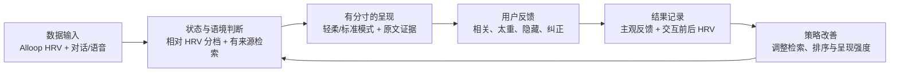

# Physical AI Hackathon · Alloop 赛道对齐说明

## 一句话方案

「我在」让生命记忆的对话与呈现感知人的当下负荷：系统只从记录者亲自确认、明确授权的内容中寻找回应，再结合 Alloop HRV 与用户主观反馈，逐步学习什么情境下该呈现什么、呈现多深。

## 为什么它仍然是「我在」

完整产品围绕生命记录、关系托付和未来接收展开；Hackathon 版本不是一份缩小的完整 PRD，而是其中一条可验证的垂直切片：

> 当一段重要记忆通过对话出现时，系统能否感知用户当下是否适合继续，以更有分寸的方式呈现，并从结果中改进下一次互动？

这条链路既保留「我在」的产品核心，也回应赛题要求的“感知—理解—反馈—改善”闭环。

## 用户与场景

核心用户仍是正在记录生命内容的人，例如妈妈。她使用记录者端留下原声、照片、文字和故事，并逐段确认与授权。

当前原型中的“女儿体验端”首先是**接收视角预览**：妈妈可以提前看见自己的资产未来会怎样被找到、引用和呈现，理解接收者可以暂停、隐藏或纠正，从而更安心地使用产品。未来进入真实托付阶段后，这一视角才由被授权的接收者使用。

Hackathon 现场以母女关系为固定故事，重点演示“有来源的记忆互动”和“状态敏感的呈现”，不试图在短时间内覆盖完整生命档案产品。

## 目标状态

系统识别的是**一次互动中的相对负荷与继续承接的适宜程度**，不是“悲伤、焦虑、抑郁”等医学或情绪标签。

- HRV 较低或数据质量不足时：降低呈现强度，不引导深入。
- HRV 位于个人相对常态时：采用标准呈现。
- 用户明确表示“太重了”时：以后优先采用轻柔模式。
- 用户要求“不再出现”或“这不是她的意思”时：隐藏相关记忆，或退回只显示本人核对过的原文。

HRV 是辅助信号；用户主动表达的反馈始终拥有更高解释权。

## 完整闭环

| 阶段 | 输入或输出 | AI / 系统职责 |
| --- | --- | --- |
| 感知 | Alloop HRV、对话文字、Omi/手机语音分块 | 接收数据并保留时间、质量与来源 |
| 理解 | 用户当前语境、记录者已确认内容、相对 HRV 状态 | 判断是否有证据匹配，并选择安全呈现模式 |
| 反馈 | 中性信使说明、本人原话、来源、反馈选项 | 组织表达但不伪造记录者的新话 |
| 改善 | 主观反馈、交互前后 HRV outcome | 保存安全偏好，逐步调整后续检索和呈现策略 |

## HRV 如何使用

HRV 采用相对基线和时效/质量校验。当前后端支持固定基线与滚动中位数策略，并将有效读数分为 `low`、`normal`、`high`；缺失、过期或质量不足时回到标准模式，不猜测用户状态。

系统只允许 HRV 影响：

- 文案长度和信息密度；
- 是否减弱动效；
- 是否继续引导探索；
- 一次互动的前后结果记录。

系统不允许 HRV 决定：

- 哪段生命记忆更“重要”或更“真实”；
- 用户正在经历哪一种具体情绪；
- 医学、心理或压力诊断；
- 是否自动发送敏感内容。

单次 HRV 变化也不能证明一段对话“治愈”了用户。Demo 只把它视为一个辅助结果信号，并与用户主观反馈共同解释。

## “学习更多这种对话”的准确含义

当一次互动收到正向主观反馈，且后续 HRV 没有显示更高负荷时，理想策略是提高**相似语境—真实记忆证据—呈现方式**这一组合的候选权重。这里鼓励的是更多合适的互动路径，而不是生成更多看似来自妈妈的新对话。

当结果变差或用户认为太重时，系统降低强度、停止深入或隐藏相关内容。无论学习结果如何：

- 原始声音、文字、照片和授权不会被改写；
- AI 生成的信使说明始终与本人原话分开；
- 每次呈现都应能回到具体证据；
- 用户可以覆盖算法判断。

当前代码已经实现交互前后 HRV outcome、主观反馈持久化，以及 `too_heavy`、`suppress_memory`、`misrepresents_creator` 对后续安全策略的影响。正向 outcome 自动提高相似情境排序，仍属于下一步策略扩展，不应在演示中表述为已完成。

## 当前 Demo 与长期产品的边界

| 内容 | 当前状态 |
| --- | --- |
| 固定母女故事与核对原文 | 已实现，可稳定演示 |
| 记录者端 / 接收视角交互 | 已实现为高保真 Web 原型 |
| 后端证据匹配与中性回信 | 已实现，支持 OpenAI 或确定性本地模式 |
| HRV 上报、分档与呈现模式 | 已实现 API 与模拟脚本 |
| 主观反馈与 outcome | 已实现 |
| Omi 语音分块接收 | 已实现接收与最近状态；尚未自动转写或分析 |
| 真实戒指到后端的现场端到端链路 | 需要在实际设备与网络环境复验 |
| 完整生命档案、账号、云端托付与长期学习 | 产品愿景，不属于本次 Demo 完成范围 |

## 现场演示建议（约 1 分钟）

1. **0–10 秒：产品与用户。** 妈妈记录并确认一段真实原话，接收视角只显示获授权的内容。
2. **10–20 秒：感知。** 上报一条 Alloop HRV，页面显示读数新鲜度和相对状态，不显示情绪诊断。
3. **20–38 秒：理解与反馈。** 在信使中输入一个与真实记忆相关的情境，后端返回中性说明、原文证据和轻柔/标准呈现模式。
4. **38–50 秒：用户反馈。** 点击“很相关”或“太重了”，展示反馈如何影响后续安全偏好。
5. **50–60 秒：闭环与边界。** 查看 outcome，并说明系统学习的是检索与呈现策略，原始内容永远不被改写。

官网中的 46 秒 AI 概念短片用于介绍产品愿景，不替代上述现场功能演示。

## 隐私与适用边界

- 生理数据与内容数据应获得分别、明确的用户授权。
- HRV 只保留完成相对状态判断和结果评估所必需的字段与时长。
- 语音分块当前只证明可靠接收；未转写时不能声称完成语义或情绪分析。
- 正式产品需要补齐账号鉴权、静态与传输加密、撤回/删除、访问审计及本地/云端边界说明。
- 本系统不是医疗器械，不提供诊断、治疗或危机干预。
