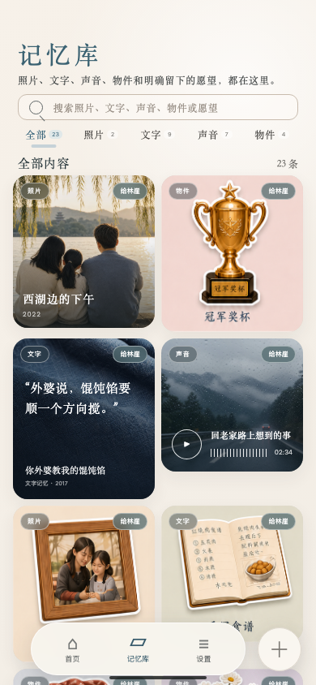
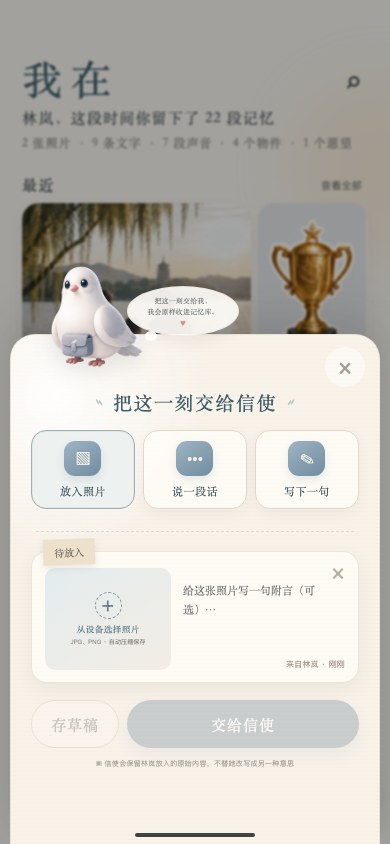
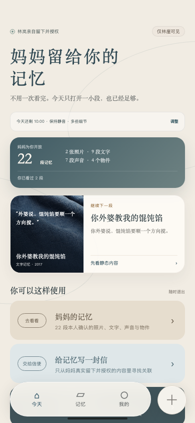
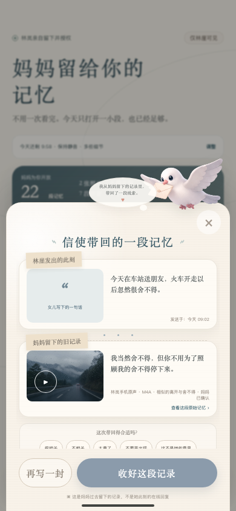

# 我在｜母女关系记忆体验原型

一个围绕「真实留下、逐段授权、有分寸地抵达」设计的双角色移动端 Web 原型。

妈妈负责留下照片、原文、原声与物件故事；女儿决定何时打开、看多少、是否听声音，以及是否回应。项目依据生命受限创作者版 PRD 与 [Figma 信息架构](https://www.figma.com/design/DEfUNVysNpAa54Okn8PSxc/Untitled?node-id=0-1&p=f) 完成，目前是可交互的纯前端体验原型。

## 视觉预览

<table>
  <tr>
    <td align="center"><br /><b>妈妈端首页</b></td>
    <td align="center"><br /><b>混合媒体记忆库</b></td>
    <td align="center"><br /><b>信鸽记录编辑器</b></td>
  </tr>
  <tr>
    <td align="center"><br /><b>女儿端首页</b></td>
    <td align="center"><br /><b>记忆与原始来源</b></td>
    <td align="center"><br /><b>女儿端信鸽回信</b></td>
  </tr>
</table>

## 双端交互

### 妈妈端：单向保存与授权

```text
首页浏览
  → 点击加号
  → 选择照片 / 原声 / 文字
  → 存草稿或交给信使
  → 自动回到首页并显示保存状态
  → 内容进入记忆库并按授权留给女儿
```

妈妈端不需要等待回信，也不会出现「信使带回的一段记忆」或关联反馈。发送中的页面刷新会恢复进度，最终只入库一次。

当前能力：

- 首页动态统计照片、文字、声音、物件与愿望。
- 图片上传最大 12 MB，最长边压缩至 1280 px 并保存为 JPEG。
- 支持音频文件与最长 60 秒的浏览器录音。
- 支持独立采集页、草稿、本人确认与逐段授权。
- 记忆库支持搜索、类型筛选与类型数量。
- 内置 23 项混合媒体演示内容：2 张照片、9 条文字、7 段声音、4 个物件和 1 个愿望。
- 详情页展示日期、场景、原始来源、故事和原声状态。
- 每段记忆可单独调整女儿可见性，以及「回应」「探索」权限。
- 可预览女儿真正会看到的版本。

### 女儿端：主动打开与关系往返

```text
阅读接收说明
  → 选择停留时间、声音和内容强度
  → 看一段妈妈真实留下的记忆
  → 写信 / 找线索 / 处理可拒绝的愿望
  → 把自己的内容保存到「我的」或随时退出
```

当前能力：

- 首次进入必须主动同意，可选择 5、10 或 15 分钟。
- 默认静音；原声必须由女儿主动点击。
- L1「轻一点」与 L2「多些细节」会实际过滤内容。
- 只展示妈妈已确认且明确授权给林崖的记录。
- 女儿写给信使的内容会在妈妈的真实记录中寻找关联。
- 当前关联使用可审查的本地关键词规则，不生成妈妈没有说过的话。
- 支持「很相关」「不相关」「太重了」「不要再出现」「这不是她的意思」反馈。
- 可隐藏或恢复记忆、暂停主动出现、删除自己的记录。
- 「我的」保存女儿自己的话、轻行动、补充与关系反思，不会被改写成妈妈的内容。

## 视觉语言

| 层级 | 设计规则 |
| --- | --- |
| 基础色 | 米白纸张 `#f6f2eb` / `#fffdf8` |
| 主色 | 深蓝灰 `#263b43` / `#536b79` |
| 辅助色 | 鼠尾草绿、暖陶色，用于关系、授权和情绪提示 |
| 叙事字体 | `Songti SC` / `STSong`，用于标题、引文与故事正文 |
| 操作字体 | `PingFang SC` / `Microsoft YaHei` / `system-ui` |
| 界面质感 | 纸张卡片、手写标签、缝线、柔和阴影、圆角和半透明导航 |
| 动效 | 信鸽承担静候、交付、寻找和带回记忆的状态反馈 |

记忆卡按照片、文字、声音和物件使用不同模板。声音卡使用波形与多组氛围色，不重复套用同一张无关图片。设置中的「减少动态效果」会将动画与过渡降至最低。

## 前端实现

### 技术栈

- React 19
- TypeScript 5.9
- Vite 7
- 原生 CSS，无 UI 框架
- Canvas 图片压缩
- FileReader / Data URL 本地媒体保存
- MediaRecorder 浏览器录音
- 无 React Router、无状态管理库、无后端依赖

### 页面状态

页面由 `src/App.tsx` 内的 `Page` 状态机切换：

| 角色 | 页面 |
| --- | --- |
| 妈妈端 | `creator`、`capture`、`library`、`detail`、`settings` |
| 女儿端 | `recipient`、`gallery`、`echo`、`seek`、`wish`、`you` |

妈妈和女儿使用独立信使通道：妈妈通道是单向保存，完成后回到 `idle`；女儿通道保留发送、带回、阅读、反馈和历史往返。

### 本地状态

| Storage Key | 内容 |
| --- | --- |
| `wozai-seeds-v1` | 妈妈记忆、授权与上传媒体 |
| `wozai-capture-draft-v1` | 独立采集页草稿 |
| `wozai-messenger-state-v2` | 双角色信使通道与发送状态 |
| `wozai-messenger-history-v1` | 信使历史兼容数据 |
| `wozai-messenger-drafts-v1` | 双角色未发送草稿 |
| `wozai-recipient-data-v1` | 女儿接收设置、会话、浏览、隐藏、记录与反思 |
| `wozai-quiet-mode` | 减少动态效果 |
| `wozai-setting-*` | 智能整理、面容解锁演示与提醒频率 |
| `wozai-current-page-v1` | 当前页面，保存在 `sessionStorage` |

主要数据监听 `storage` 事件以支持同源多标签页同步。图片和音频以 Data URL 保存在浏览器本地；清理站点数据会删除用户新增内容。正式产品需要替换为鉴权、数据库和对象存储。

### 响应式与可访问性

- 大于 820 px：310 px 产品导航侧栏 + 430 px 手机设备框。
- 小于等于 820 px：移动端全屏 `100dvh`。
- 使用 `env(safe-area-inset-*)` 适配刘海屏和底部安全区。
- 对 390 px 以下宽度以及 950、720、480 px 以下高度做额外布局适配。
- 移动端主要操作控件约为 44 px 点击高度。
- 提供键盘 `focus-visible` 轮廓和常用 ARIA 状态。

## 视觉素材

```text
public/assets/
├── figma/    # 首页、记忆库、信鸽流程的参考图与裁切源图
├── mascot/   # profile、delivering、returning-letter、idle、writing 信鸽透明素材
└── demo/     # 西湖家庭照、雨天道路、手写笔记与织物纹理
```

`writing.webp` 已保留但当前页面尚未接入，其余信鸽状态均已使用。网页中新上传的媒体保存在浏览器本地，不会写入 `public/assets/`。

## 目录结构

```text
.
├── docs/images/       # README 当前版本界面截图
├── public/assets/     # Figma、信鸽与记忆示例素材
├── src/
│   ├── App.tsx        # 数据模型、页面、双端流程与交互状态
│   ├── main.tsx       # React 入口
│   └── styles.css     # 视觉系统、组件与响应式规则
├── index.html
├── package.json
├── pnpm-lock.yaml
├── tsconfig*.json
└── vite.config.ts
```

## 本地运行

环境建议：Node.js 20.19+，pnpm 9+。

```bash
pnpm install
pnpm dev
```

生产构建与预览：

```bash
pnpm build
pnpm preview
```

开发服务绑定 `127.0.0.1`，端口以终端输出为准。

## 原型边界

- 当前没有服务端、账号体系、云备份或真实面容解锁。
- 演示声音卡没有对应音频文件时，只展示播放器状态并明确标注。
- 本地关键词关联用于说明「只从真实记录中寻找」的产品边界，不等同于正式语义检索。
- AI 整理后的故事必须保留原始来源，并由记录者确认后才能交付。
